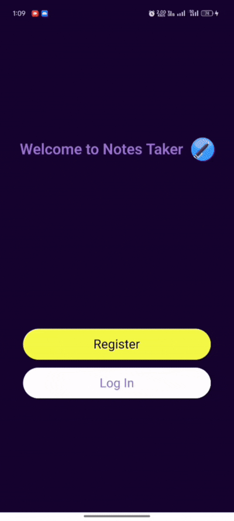
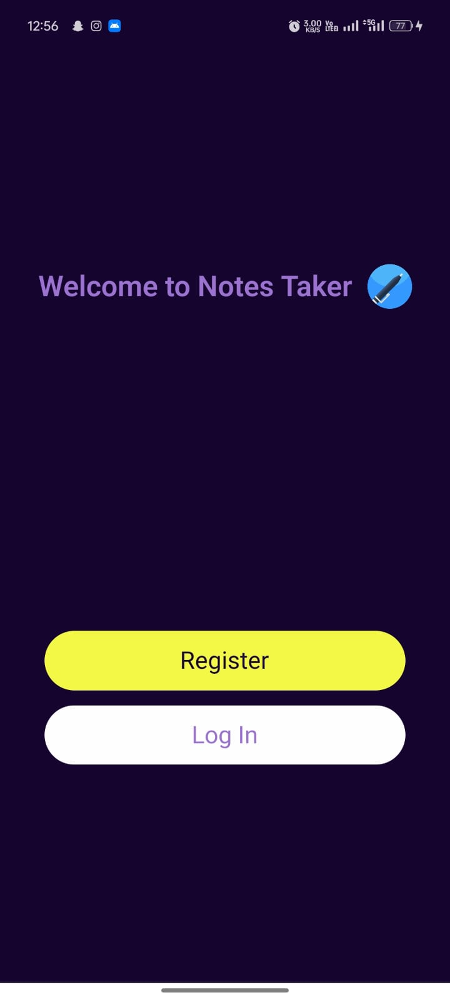
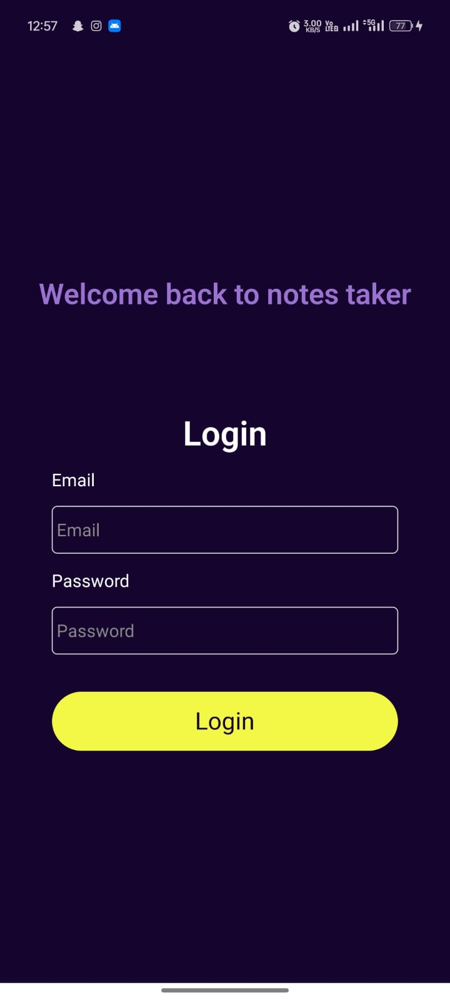
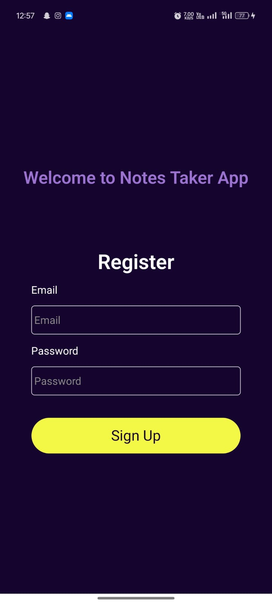
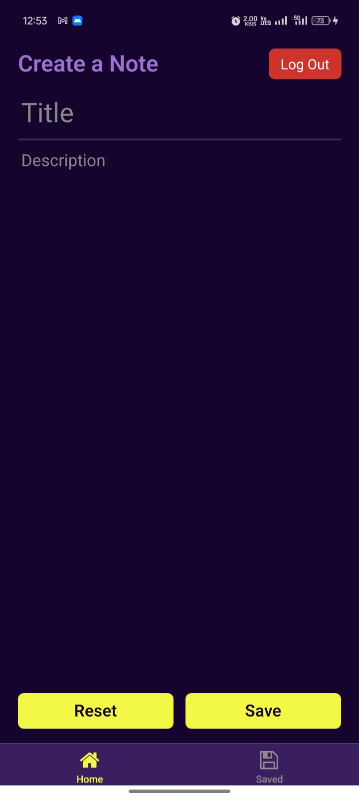
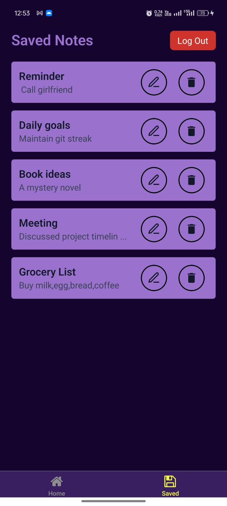
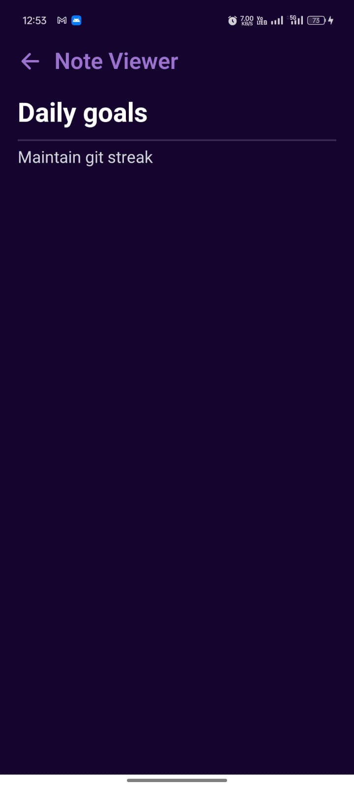
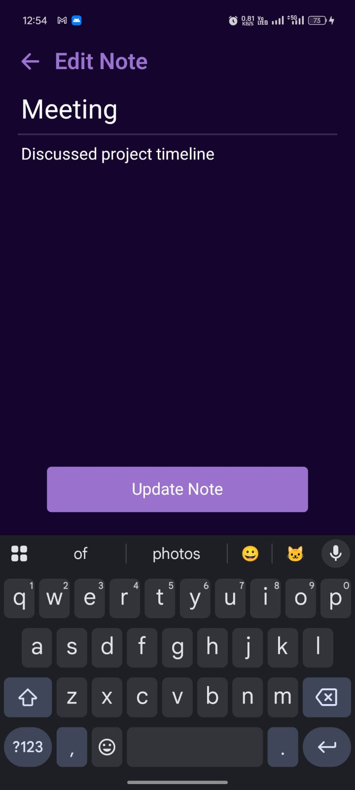

# Notes Mobile App (React Native + Axios + Express + MongoDB)

This is a secure, full-stack **Notes Mobile Application** built using:
- React Native (Expo) for the frontend
- Express.js for the backend API
- MongoDB + Mongoose for data storage
- JWT Authentication and Refresh Tokens
- bcrypt for password hashing
- Secure storage using expo-secure-store

---

## 🚀 Demo





## 📸 Screenshots

<p align="center">
  
  
  
  
  
  
  
</p>

## 🔐 Features

### Authentication
- User Signup and Login with JWT tokens
- Securely store tokens using `expo-secure-store`
- Logout functionality

### Notes Management
- Create new notes (title + description)
- Fetch only notes belonging to the logged-in user
- View list of saved notes

---

## 📁 Project Structure

### Frontend (React Native - Expo)
```
note-taker-backend/
│
├── app/
│   └── (auth)/         # signup, login screens
│   │     └── _layout.jsx
│   │     └── login.jsx
│   │     └── signup.jsx
│   └── (tabs)/         # home and saved screens
│   │     └── _layout.jsx
│   │     └── home.jsx
│   │     └── saved.jsx
│   └──_layout.jsx
│   └──index.jsx       # '/' route
│
├── api/
│   └── axiosInstance.js        # axios config setup and axios interceptors
├── context/
│   └── AuthContext.js           #context api for functions login,signup,refreshToken
│
├── assets/
│   └── fonts/              
│   └── images/          
│
├── utils/
│   └── storage.js                # storing and fetching tokens on native app   
│           
│
├── .env
└── README.md


```

### Backend (Express.js)
```
note-taker-backend/
│
├── controllers/
│   └── authController.js         # signup, login, refresh logic
│   └── notesController.js        # get, add, update, delete notes
│
├── middleware/
│   └── authenticateJWT.js        # middleware to verify access token
│
├── models/
│   └── userModel.js              # Users Schema model
│   └── notesModel.js             # Notes Schema model
│
├── routes/
│   └── authRoutes.js             # /signup, /login, /refresh-token
│   └── noteRoutes.js             # /notes (GET, POST, DELETE)
│
├── utils/
│   └── tokenUtils.js             # generateAccessToken, generateRefreshToken
│
├── .env                           # JWT secrets, config
├── app.js                          # Express app
├── server.js                     # Entry point
├── package.json
└── README.md


```

---

## 🚀 Getting Started

### Prerequisites
- Node.js & npm
- MongoDB (local or Atlas)

### Backend Setup

1. Navigate to the backend folder:
```bash
cd note-taker-backend
```
2. Install dependencies:
```bash
npm install
```
3. Create `.env` file:
```
PORT=3000
MONGO_URI=your_mongoDB_url
JWT_SECRET=your_jwt_secret
ACCESS_TOKEN_EXPIRY=30m
REFRESH_TOKEN_EXPIRY=7d
```
4. Start the server:
```bash
npm start 
```

or
(Install Nodemon as a dev dependency)
```bash
nodemon server.js 
```

### Frontend Setup

1. Navigate to the frontend folder:
```bash
cd frontend
```
2. Install dependencies:
```bash
npm install
```
3. Start the app:
```bash
expo start
```

---

## 🔐 Security Notes

- JWT tokens are stored securely using `expo-secure-store`.
- Passwords are hashed using `bcrypt` before saving to the database.
- API routes are protected using JWT middleware.

---

## 📜 License
This project is for educational purposes and free to use.

## Built By Sudeep
